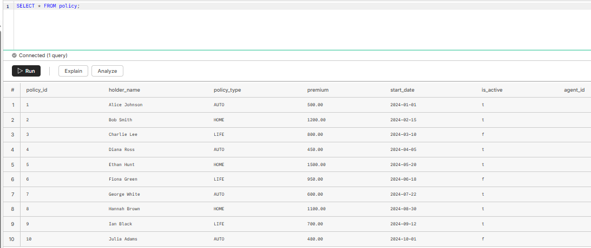
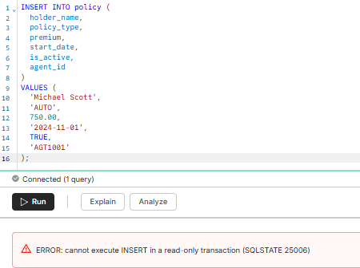

Cold-start timing --> Took 2 ish seconds to start and then queries were almost instant 
  
  
Read Replica  

Selecting works   

  

Changing Does Not  

  
Direct Connect vs Connection Pooling

Each client gets their own Postgres connection vs Many client connections reuse a small pool of real DB connections

Connection pooling can support up to about 10,000 connections and has lower resource usage

Connnections with pooling don't map 1:1 to clients
